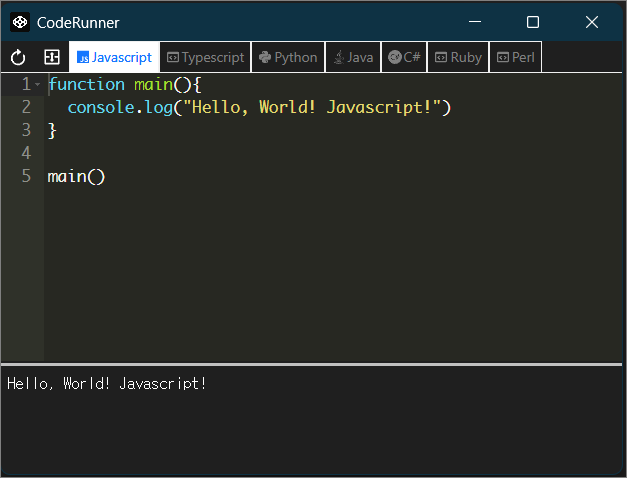

# Code Runner



### Install

1. `git clone https://github.com/emfprhs119/code-runner.git`
2. `npm i -g @neutralinojs/neu` (skip if `neu` is already installed)
3. `neu update`
4. `cd react-src && npm install`
5. `cd ../ && npm run dev`

### Requirements

This program does not have an executable program built in. Please refer to "language.json" for a list of programs required for execution.

### Run

```
npm run dev
```

it's an alias to `neu run -- --window-enable-inspector`

### Build

```
npm run build
```

it's an alias to `neu build`

### Build + zip

```
neu build --release
```
